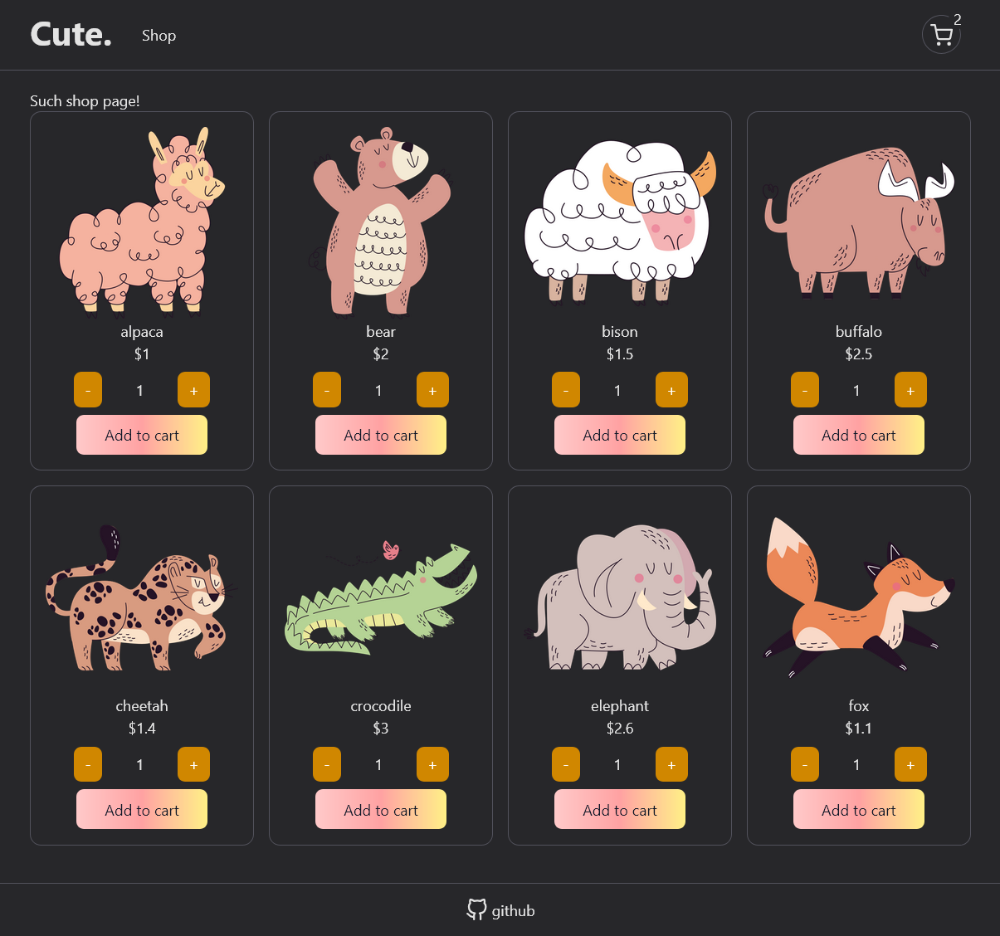

# Shopping cart

The Shopping cart project of The Odin Project React course. Built with Vite, React, React Testing Library and some patience.

- Lesson: https://www.theodinproject.com/lessons/node-path-react-new-shopping-cart
- Live preview: https://odin-shopping-cart-3000.netlify.app/

## Features

- multiple pages (home, shop, shopping cart) powered by react-router;
- product counter in header;
- quantity component for changing product quantity;
- calculate total price in shopping cart;

## Thoughts

- everything takes more time that you are estimate;
- react-router is an unnecessary complicated library with poor documentation, it lacks of sane examples of usage;
- testing react app feels strange; react-router adds a huge amount of complexity to tests;
- it's better to have some design/UI to start with;
- vite/vitest are cool (do you remember your experience with webpack?);

## TODO

- [ ] add products from remote API
- [ ] add products with different categories
- [ ] add according routes to these products
- [ ] add git hook for running tests before commit
- [ ] add product page?
- [ ] add coupon/sales/discount
- [ ] add "out of stock" label when there is no price (fix "add to cart" button as well too)
- [ ] show loader while fetching products